# LaMo: Self-Supervised Latent Motion Priors for Physical Realism in Video Generation

<p align="center">
  <strong>LaMo</strong> improves physical realism in video generation by learning motion priors from unlabeled videos.
</p>

<p align="center">
  <a href="https://scholar.google.com/citations?user=UlDxGP0AAAAJ">Bo Jiang</a><sup>1,*</sup>,
  <a href="https://scholar.google.com/citations?user=2oYPT9IAAAAJ">Depu Meng</a><sup>1</sup>,
  <a href="https://scholar.google.com/citations?user=lf0bLigAAAAJ">Yihan Hu</a><sup>1</sup>,
  <a href="https://scholar.google.com/citations?user=SdX6DaEAAAAJ">Yichen Xie</a><sup>1,2,*</sup>,
  <a href="https://scholar.google.com/citations?user=I6_dXvEAAAAJ">Tianshuo Xu</a><sup>1,*</sup>,
  <a href="https://scholar.google.com/citations?user=xVN3UxYAAAAJ">Wei Zhan</a><sup>1,2</sup>
</p>

<p align="center">
  <sup>1</sup>Applied Intuition &nbsp;&nbsp; <sup>2</sup>University of California, Berkeley
  <br>
  <sup>*</sup>Work done during internship at Applied Intuition.
</p>

<p align="center">
  <a href="https://arxiv.org/abs/2605.23878"></a>
  <a href="https://lamo-ai.github.io/"></a>
  
  
</p>

<p align="center">
  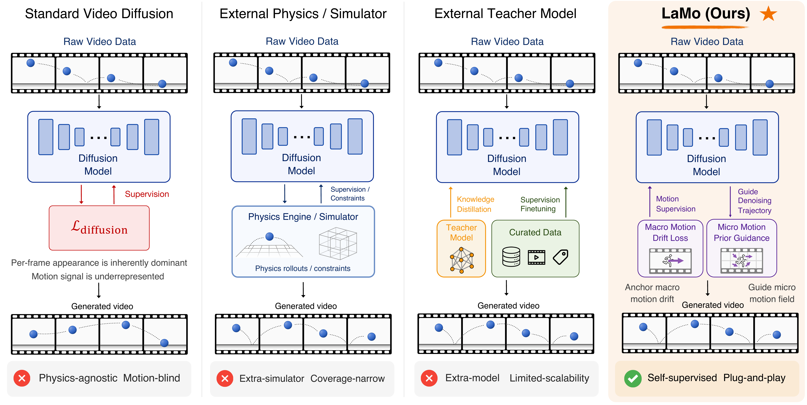
</p>

## News

- `[2026-06]` Training, inference, and evaluation code released.
- `[2026-05]` LaMo paper is available on arXiv.

## Highlights & Introduction

This repo contains the implementation of **LaMo**, including training, inference, evaluation, and interpretability scripts.

LaMo is designed for improving motion and physical consistency in text-to-video diffusion models:

- **Self-supervised motion prior** learned from ordinary unlabeled videos.
- **No external simulators, teacher models, or physics annotations** required.
- **Plug-and-play design** for existing video diffusion backbones.
- **Training-time and inference-time components** that can be used together or independently.
- **Improved physical commonsense** on VideoPhy and VideoPhy2.
- **Preserved general video quality** on VBench.

<p align="center">
  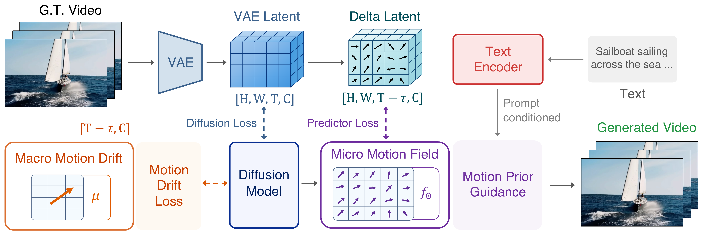
</p>

## Qualitative Results

The examples below compare CogVideoX-5B and LaMo-5B on physical motion prompts.
Click a preview to open the MP4.

| Prompt | CogVideoX-5B | LaMo-5B |
|---|---|---|
| Milk spilling into coffee creates waves. | [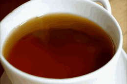](assets/demo_videos/0-1.mp4) | [](assets/demo_videos/0-2.mp4) |
| Coin spins rapidly on a wooden table. | [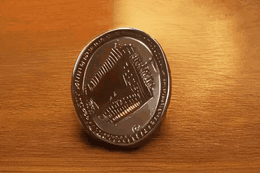](assets/demo_videos/1-1.mp4) | [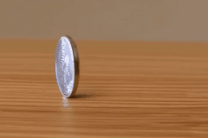](assets/demo_videos/1-2.mp4) |
| A honey dipper drizzles honey onto Greek yogurt. | [](assets/demo_videos/2-1.mp4) | [](assets/demo_videos/2-2.mp4) |
| An apple falls into a vat of cider, sending up a spray. | [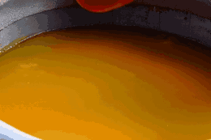](assets/demo_videos/3-1.mp4) | [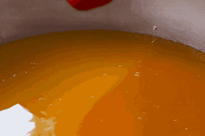](assets/demo_videos/3-2.mp4) |
| A pro surfer sails smoothly on the wave-kissed waters. | [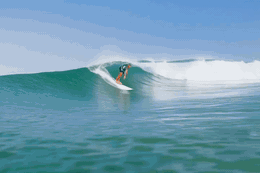](assets/demo_videos/4-1.mp4) | [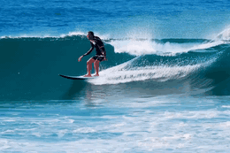](assets/demo_videos/4-2.mp4) |
| Tablecloth is draped over the dining table. | [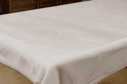](assets/demo_videos/5-1.mp4) | [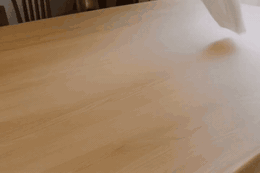](assets/demo_videos/5-2.mp4) |
| Pouring beer into a glass, creating white foam. | [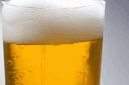](assets/demo_videos/6-1.mp4) | [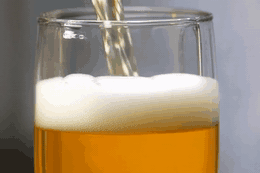](assets/demo_videos/6-2.mp4) |
| A mountain biker descends fast through a dirt trail. | [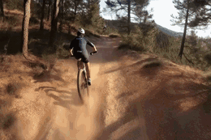](assets/demo_videos/7-1.mp4) | [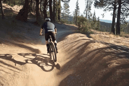](assets/demo_videos/7-2.mp4) |

## Main Results

### VideoPhy

SA measures semantic adherence and PC measures physical commonsense.

| Method | Extra Supervision | Overall SA | Overall PC |
|---|---:|---:|---:|
| CogVideoX-2B | - | 60.5 | 25.6 |
| MoAlign-2B (reimpl.) | VideoMAE | 64.5 | 30.1 |
| VideoREPA-2B | VideoMAEv2 | 64.2 | 29.7 |
| **LaMo-2B** | **Self-supervised** | **67.2** | **31.4** |
| CogVideoX-5B | - | 70.0 | 32.3 |
| PhyT2V-5B | o1-preview | 61.0 | 37.0 |
| WISA-5B | Qwen2VL | 67.0 | 38.0 |
| PHANTOM-5B | V-JEPA2 | 47.5 | 37.9 |
| MoAlign-5B (reimpl.) | VideoMAE | 72.2 | 39.4 |
| VideoREPA-5B | VideoMAEv2 | 72.1 | 40.1 |
| **LaMo-5B** | **Self-supervised** | **73.0** | **41.0** |

### VideoPhy2

| Method | SA | PC |
|---|---:|---:|
| CogVideoX-2B | 21.0 | 68.0 |
| PHANTOM-5B | 27.8 | 71.7 |
| MoAlign-2B (paper) | 28.8 | 75.0 |
| MoAlign-2B (reimpl.) | 24.6 | 73.1 |
| VideoREPA-2B | 21.0 | 72.5 |
| **LaMo-2B** | **25.4** | **75.4** |

### VBench

| Method | Quality Score | Semantic Score | Total Score |
|---|---:|---:|---:|
| CogVideoX-5B | 80.5 | 68.7 | 78.2 |
| **LaMo-5B** | **81.9** | **70.7** | **79.6** |

## Interpretability

<p align="center">
  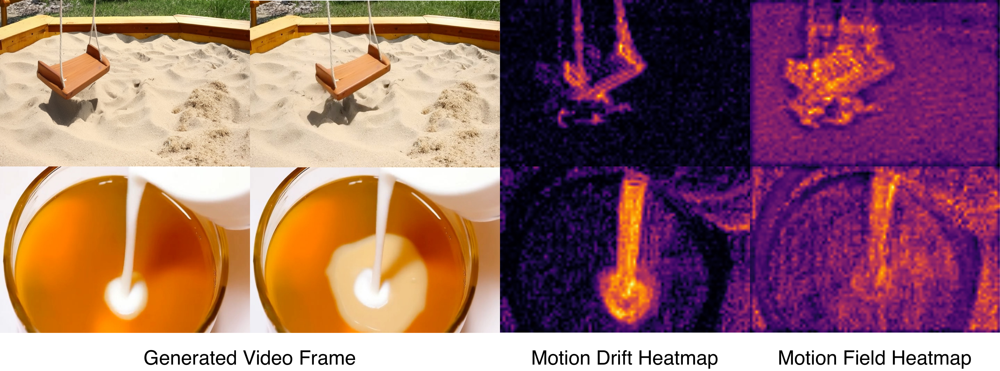
</p>

<p align="center">
  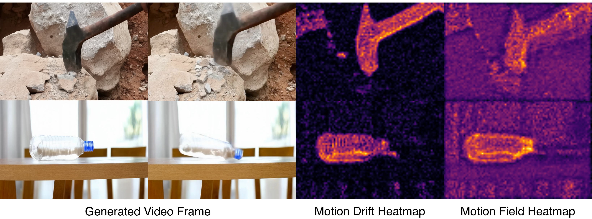
</p>

LaMo's motion prior provides heatmaps that localize physically active regions, including dominant latent drift and prompt-conditioned motion-field responses.

## Getting Started

### Installation

```bash
git clone <LAMO_REPO_URL>
cd <PATH_TO_LAMO_REPO>

conda create -n lamo python=3.10 -y
conda activate lamo

pip install --upgrade pip
pip install -r requirements.txt
pip install -e .
```

Model and evaluator weights are not included. Put them under `pretrain_models/`
or pass local paths to the launchers. See [docs/getting_started.md](docs/getting_started.md)
for the full asset layout and benchmark notes.

### Train

```bash
# Edit train/configs/model_config_train_eval.yaml first.
MODEL_CONFIG_YAML=train/configs/model_config_train_eval.yaml \
bash train/scripts/run_cluster_train_local_lamo.sh
```

### Inference

Generate with LaMo:

```bash
CUDA_VISIBLE_DEVICES=0 python tests/generate_lamo.py \
  --model_path <PATH_TO_COGVIDEOX_BASE_MODEL> \
  --lora_path <PATH_TO_LORA_WEIGHT_DIR> \
  --physical_module_path <PATH_TO_PREDICTOR_SAFETENSORS> \
  --prompt "A bowl of clear water slowly freezes into a transparent block of ice." \
  --output_file outputs/lamo \
  --guidance_lambda 15.0 \
  --guidance_step_ratio 0.8
```

If `predictor.safetensors` is placed next to the LoRA weights,
`--physical_module_path` can be omitted.

### Evaluate

```bash
bash eval/scripts/download_videocon_physics.sh
bash eval/scripts/download_videophy2_auto.sh
bash eval/scripts/download_vbench_pretrained.sh
```

```bash
CUDA_VISIBLE_DEVICES=0,1 bash eval/scripts/run_videophy_eval.sh
CUDA_VISIBLE_DEVICES=0,1 bash eval/scripts/run_videophy2_eval.sh
CUDA_VISIBLE_DEVICES=0,1 bash eval/scripts/run_vbench_eval.sh
```

### Visualize

Run LaMo interpretability visualization:

```bash
CUDA_VISIBLE_DEVICES=0 python tests/interpret_lamo.py \
  --model_path <PATH_TO_COGVIDEOX_BASE_MODEL> \
  --lora_path <PATH_TO_LORA_WEIGHT_DIR> \
  --predictor_ckpt <PATH_TO_PREDICTOR_SAFETENSORS> \
  --prompt "A coin spins rapidly on a wooden table." \
  --num_samples 1 \
  --work_dir outputs/interpret_lamo
```

The script writes per-sample frames, BMV heatmaps, predictor-response heatmaps, a combined grid, and raw arrays under `--work_dir`.

For full setup and benchmark details, see [docs/getting_started.md](docs/getting_started.md).

## Repository Layout

- `finetrainers/`: LaMo model, trainer, processors, and utility code.
- `train/`: training entry points, launchers, accelerate configs, and train-eval config templates.
- `eval/`: benchmark launchers, eval configs, metadata, and evaluator code for VideoPhy, VideoPhy2, and VBench.
- `docs/`: extended setup, training, inference, and benchmark notes.
- `tests/generate_lamo.py`: LaMo text-to-video inference.
- `tests/generate_cogvideox.py`: CogVideoX baseline inference.
- `tests/interpret_lamo.py`: LaMo interpretability visualization.

## Citation

If you find LaMo useful, please consider citing:

```bibtex
@article{jiang2026lamo,
  title={LaMo: Self-Supervised Latent Motion Priors for Physical Realism in Video Generation},
  author={Bo Jiang and Depu Meng and Yihan Hu and Yichen Xie and Tianshuo Xu and Wei Zhan},
  journal={arXiv preprint arXiv:2605.23878},
  year={2026}
}
```

## Acknowledgements

This work was conducted at Applied Intuition. LaMo builds upon
[WISA](https://github.com/360CVGroup/WISA),
[VideoREPA](https://github.com/aHapBean/VideoREPA), and
[Diffusers](https://github.com/huggingface/diffusers). We thank the authors and
maintainers for releasing their code.

## License

This project is licensed under the Apache License, Version 2.0 — see the
[LICENSE](LICENSE) file for details. Copyright (c) 2026 Applied Intuition, Inc.

This repository vendors and adapts third-party code (finetrainers, VBench,
VideoPhy, mPLUG-Owl); see [NOTICE](NOTICE) for attributions and their
license terms.
